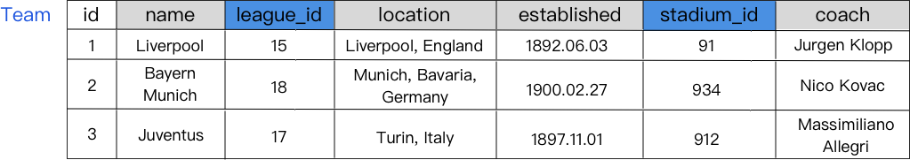
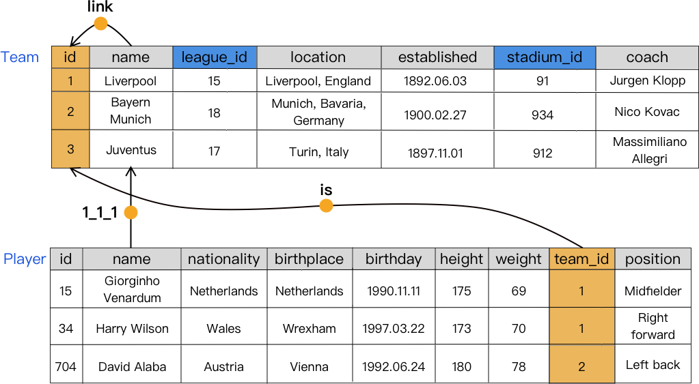
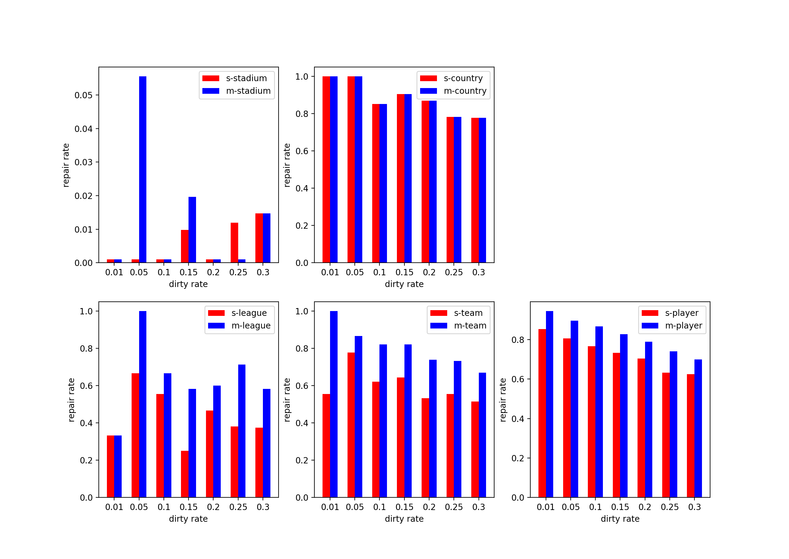

Scruber
===


English | [简体中文](./README_CHN.md)

## Problem Description
In relational database data cleaning, [KATARA](http://da.qcri.org/ntang/dcprojects/katara.html)[ | (here is the paper)](http://da.qcri.org/ntang/pubs/katara.pdf) has been able to better clean data for single tables by using knowledge base and crowd.

However, due to the special structure of a relational database, and in order to save storage space, the foreign keys of a single relational table often store the IDs of entities in other relational tables instead of the entire field. At this time, the knowledge graph cannot judge a simple and independent ID field.This problem is even more serious when it is assumed that the metadata information of the table is not known during cleaning.



For example, in the figure above, all the **league_id** and **stadium_id** in the **Team** table are actually data in other tables. Without knowing the metadata of the data table, if we directly enter **15, 91, 938** into the knowledge base, we cannot get the result our desired.


## Simple Idea
If we can build a pattern for the entire database at the same time, and then use the pattern to clean the tables, then when the knowledge graph cannot get the results we expect, we can still look up other tables to correct the problematic data.


## Experiment
### Dataset
- KB: Use reasonably sized RDF-like datasets to simulate knowledge base queries
    - [7lore](http://www.openkg.cn/dataset/7lore)
    - [ownthink](http://www.openkg.cn/dataset/ownthink-v2)

- DB (Tables): Create a table dataset with reference to the following data model
    - [kaggle-soccer](https://www.kaggle.com/hugomathien/soccer)

### Main Algorithm
#### 1 Multi-table Pattern Creation
The build of the pattern is actually to create a directed graph with sideband semantics. The function of the pattern is to be able to correspond to the structure in the knowledge graph, so we can query the knowledge graph for any two matching entities (vertices)Semantic relationship (edge).Similarly, for any matching entity and semantic relationship, another related entity is queried.

What we need to solve here is how to add the **id** to the pattern reasonably without knowing the table meta information, so there are:
```go
Definition table_list is all data tables of the entire database
Define col_list as all columns in a data table
for t in table_list:
    for C in col_list:
        if No correlation between C and other data columns in KB：
            Sort existing degrees of nodes in this table
            Query the association relationship between the node with the largest degree A and the other nodes with the largest degree B in KB
            if If there is a relation：
                Add the relationship that has been found in the pattern (reduce the repeated query after)
                For another match table:
                    Count the number of unique values ​​D in all node columns in the table
                    Take the largest node F and establish a 'link' relationship with the matching node column B
                    verify A --'kbr'--> B --'link'--> F --'is'-- C
                    if so：build coding relationships A --'t2-c(A)-c(B)' --> C
            else：
                Take the node with the second highest degree to continue
        The relationship in pattern is empty if no matching columns exist
```
Where **kbr** represents the relationship obtained from the KB (knowledge base), **t2** represents the matching table number found, and **c(A)** represents the column number where A is located.Using the encoding relationship can quickly find the data by inverse encoding during the repair phase.The pattern after the algorithm is completed is as follows:



Because the pattern of the entire database is too large, only the relationship between the two tables is shown here.

#### 2 Table Data Cleaning
When cleaning data, you need to consider the association between different tables for cleaning, including:
```go
Find the connected branches of the pattern, and do the following for each connected branch:
Count the sum of the degrees of all nodes (columns) of each table in the connected branch
for Table t with the lowest degree (lowest degree of correlation) in table_list:
    Clean the data in the table according to the pattern：
        for dirty datum dd：
        if There are KB-related edges in the pattern. First, clean up by KB-related edges:
            Get all correlated columns c_list
            for relationship in pattern：
                Get existing data cd
                Enter relationship, cd to find possible values ​​for dd from KB
            Count the possible values, take the value that appears the most
        else if：There is edge with encoding relationship
            Inverse coding solves t1, c1, c2
            Quickly find matching data by encoding
```
The cleaning from the table with the lowest total degree is to maximize the use of the repaired value after cleaning to the related table cleaning.

### Result
Here is a comparison of single-table cleaning, including line and histograms.

You can see that the second row of the graph [1,0], [1,1], [1,2] has foreign key columns in its three tables. When multiple tables participate in data cleaning at the same time, the effect is better than single tables.Cleaning, and you can see that the data cleaning effect gradually decreases with the increase in the data rate of the abscissa data table.

At the same time, it can be seen that the data cleaning effect is not good because the stadium has less data in the KB in Figure [0,0]. The country in Figure [0,1] is just the opposite, and because there is no foreign key, it is cleanedThe effect is quite.

