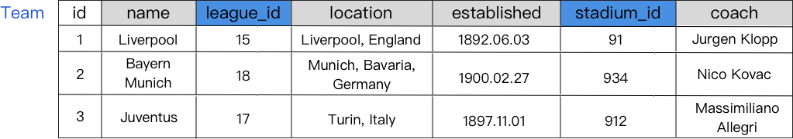
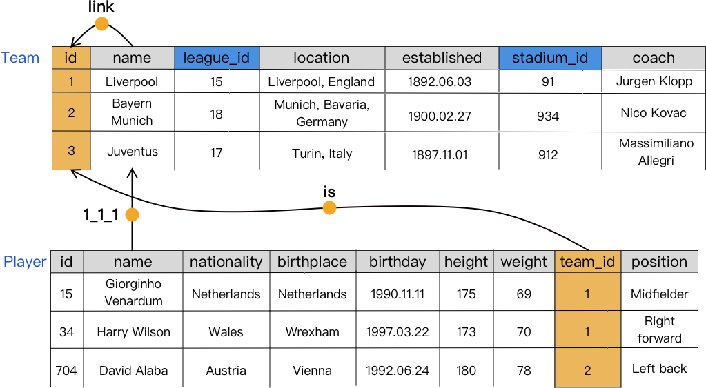

Scruber
===


[English](./README.md) | 简体中文

## 问题说明
在关系型数据库数据清洗中，[KATARA](http://da.qcri.org/ntang/dcprojects/katara.html)[ | (这里是论文)]()通过使用知识图谱和外包人力已经可以较好的对单表进行数据清洗。

但是由于关系数据库的特殊结构，同时为了节省存储空间，单个关系表的外键往往存储其它关系表的实体的 ID 而不是整个字段，此时知识图谱将无法对一个简单独立的 ID 字段进行判断。该问题在假设清洗时不知道表的元数据信息显得更加严重。



例如上图，**Team** 表中所有的 *league_id* 和 *stadium_id* 实际上是其它表中的数据，在不知道数据表元信息的情况下，如果我们直接将 **15、91、938** 输入到知识图谱中是无法得到我们期望的结果的。

## 简单的 Idea
如果我们能同时对整个数据库建立 Pattern，然后使用 Pattern 对表进行数据清洗，那么在知识图谱无法得到我们期望的结果的时候，我们依然可以通过查找其它的表来修正有问题的数据。

## 实验
### 数据说明
- KB: 使用大小较为合理的类 RDF 数据集来模拟知识图查询
    - [7lore](http://www.openkg.cn/dataset/7lore)
    - [ownthink](http://www.openkg.cn/dataset/ownthink-v2)

- DB (Tables): 参考下面的数据模型建立了表数据集
    - [kaggle-soccer](https://www.kaggle.com/hugomathien/soccer)

### 主要算法
#### 1 多表 Pattern 建立
Pattern 的建立实际上是建立一个边带语义的有向图，Pattern 的作用是能够对应到知识图谱中的结构，于是我们就能对于任意两个匹配的实体（顶点），从知识图谱中查询到语义关系（边）。同样，对于任意一个匹配的实体和语义关系，查询到另一个相关联的实体。

这里我们需要解决的的是如何在不知道表元信息的情况下，将 id 合理的添加到 Pattern 中，于是有：
```python
定义 table_list 是整个数据库的所有数据表
定义 col_list 是一个数据表中的所有列
for t in table_list:
    for C in col_list:
        if C 与其它数据列在 KB 中均找不到关联：
            对该表中节点现有的度进行排序
            取度最大的节点 A 与其余表度最大的节点 B 在 KB 中查询关联关系
            if 存在关联关系：
                在 pattern 添加现已经查到的关系（减少之后的重复查询）
                对于另一个匹配表：
                    计算表中所有节点列中的不重复值数量 D，取最大的节点 F 与匹配节点列 B 建立 'link' 关系
                    验证 A --'kbr'--> B --'link'--> F --'is'-- C 是否成立
                    如果成立：建立编码关系 A --'t2-c(A)-c(B)' --> C
            else：
                取度数次高的节点继续
        如果不存在匹配列则关系为空
```
其中 kbr 代表从 KB（knowledge base）中获取的关系，t2 表示找到的匹配表编号，c(A) 表示 A 所在列编号。使用编码关系可以在修复阶段通过逆编码快速查找到数据。算法完成后的 Pattern 如下图：



由于整个数据库的 Pattern 过大，这里只展示两个表的关系。

#### 2 表数据清洗
数据清洗时候需要考虑到不同表之间的关联关系进行清理，有：
```python
寻找 Pattern 的连通分支，对每个连通分支进行如下操作：
统计连通分支中各个表所有节点（列）的度数和
for 度最小的表t（关联度最低）in table_list:
    按照 Pattern 对表中数据进行清洗：
        对于 dirty datum dd：
        if 在 pattern 中有 KB 相关的边，首先通过 KB 相关的边进行清理：
            取出所有相关联的列 c_list
            for relationship in pattern：
                取出现有数据 cd
                输入 relationship, cd，从 KB 查询 dd 的可能值
            统计可能值，取出现最多的值
        else if：存在编码关系的边
            逆编码解出 t1，c1，c2
            通过编码快速查找匹配的数据
```
从总度数最小的表先进行清洗是为了最大程度的将清洗后修复的值二次利用到相关的表的清洗中。

### 结果
这里做了单表清洗的对比，包括折线图和直方图。

可以看到第二行图 [1,0],[1,1],[1,2] 由于其三个表中都存在外键列，在多表同时参与数据清洗的时候效果要比单表清洗，且可以看到随着横坐标数据表数据 dirty rate 的增大数据清洗效果逐渐下降。

同时，可以看到图 [0,0] 中由于 stadium 在 KB 中的数据比较少所以数据清洗效果都不好，图 [0,1] 中 country则恰好相反，同时由于其没有存在外键所以清洗效果相当。

